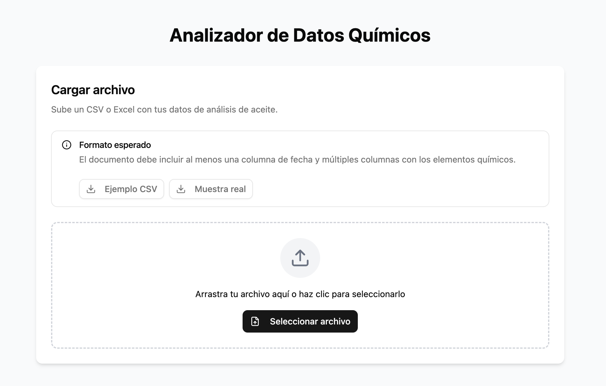

# 🔬 Analizador de Datos Químicos

**Analizador de Datos Químicos** es una SPA (single–page application) construida con React + Vite que permite **cargar, limpiar, analizar y visualizar** resultados de análisis de aceite / muestras químicas.  
Incluye exportaciones (PDF, Excel, SQL), estadísticas automáticas y un recorrido guiado para nuevos/as usuarios/as.



---

## ✨ Características principales

| Área | Descripción |
|------|-------------|
| **Carga de archivos** | Admite CSV, XLSX. El usuario indica qué columna contiene la fecha y su formato. |
| **Normalización** | Conversión automática de fechas, números y detección de cabeceras. |
| **Gráficos interactivos** | Line, Bar, Area, Scatter, Composed, Heat-map (Recharts) con selector múltiple de elementos. |
| **Tabla & paginación** | DataTable con filtrado, orden y paginación (TanStack Table). |
| **Estadísticas** | Mín · Máx · Media + diagnóstico/recomendación auto-generados. |
| **Exportación** | PDF (html-to-image + jsPDF), Excel (xlsx), SQL (sentencias `INSERT`). |
| **Tour guiado** | On-boarding con pasos resaltados + modal de bienvenida. |
| **Dark / Light mode** | Via shadcn/ui ThemeProvider. |

---

## 🛠️ Stack / Tecnologías

| Capa | Librerías / herramientas |
|------|--------------------------|
| **Frontend** | **React 18**, **Vite**, TypeScript, TailwindCSS, shadcn/ui, Lucide-react |
| **Estado / datos** | TanStack **React-Query** & **React-Table** |
| **Gráficos** | **Recharts** |
| **Exportación** | `xlsx`, `html-to-image`, `jsPDF`, `file-saver` |
| **Testing** | Vitest + React Testing Library (esqueleto) |

> Nota: no se requiere backend — todo se procesa en el navegador.

---

## 📁 Estructura de carpetas (resumen)

src/
├─ components/ ← UI re-usable (charts/, ui/, FileUploader, DataDisplay…)
├─ hook/ ← hooks TanStack (useChemicalData, …)
├─ lib/ ← helpers (file-processor, pdf-generator, date-utils)
├─ pages/ ← Home.tsx
├─ providers/ ← TanStack provider, tipos, rangos de análisis
├─ assets/ ← iconos/imágenes
└─ main.tsx ← punto de entrada Vite

## 🚀 Puesta en marcha

> Requisitos: **Node >= 18**, **npm | yarn | pnpm**

```bash
# 1. clona el repo
git clone https://github.com/reikem/chemical-data-analizer.git
cd chemical-data-analizer

# 2. instala dependencias
pnpm install              # o npm install / yarn

# 3. ejecuta en modo desarrollo
pnpm dev                  # http://localhost:5173

# 4. build producción
pnpm build && pnpm preview

🖱️ Flujo de uso
Cargar archivo en la tarjeta de inicio.

Elegir columna(s) de fecha + formato → Continuar.

Explorar pestañas «Gráficos», «Tabla», «Estadísticas».

Filtrar rango de fechas y/o seleccionar elementos químicos (multi-selector).

Exportar a PDF / Excel / SQL o imprimir.

Si es tu primera visita, acepta el recorrido guiado para conocer todas las zonas de la UI.

🙌 Contribuir
Haz fork y crea una rama feat/mi-feature.

pnpm lint && pnpm test antes del commit.

Envía un Pull Request descriptivo.

Los issues con capturas y pasos para reproducir son bienvenidos.

📄 Licencia
Distribuido bajo Apache-2.0.
Úsalo libremente citando el proyecto original.